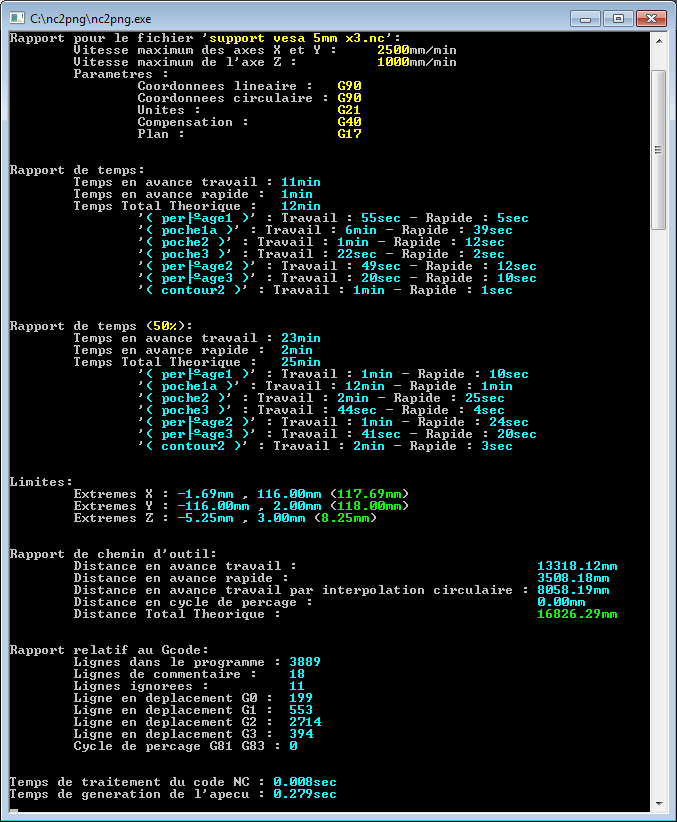
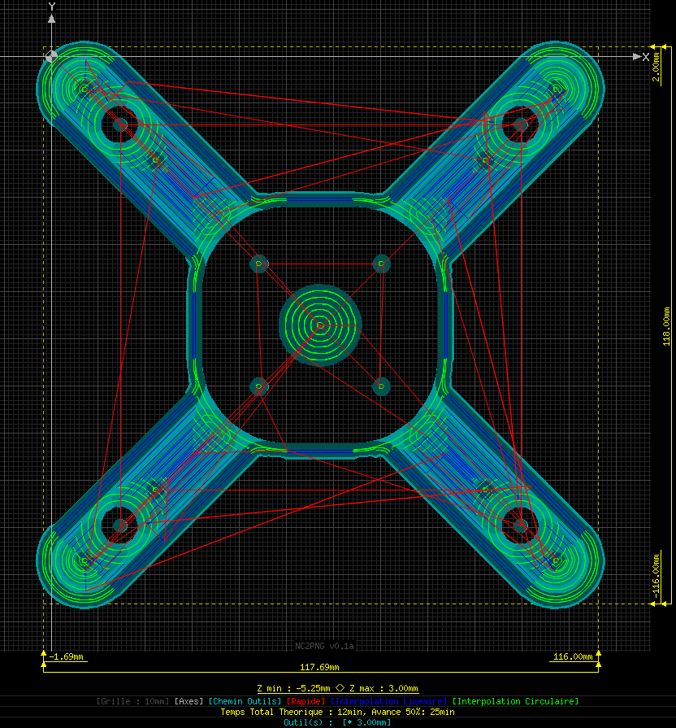

# nc2png  
Generate preview and time estimations based on gcode file (milling), English and French localized.  
  
For now, this repo is a stud...  
  
Based on a PHP script I made years ago to help me figure out time required to mill parts as well as toolpaths preview.  
  
Uses [libGD](https://libgd.github.io/), [libpng](http://www.libpng.org/) and [zlib](https://zlib.net/).  
  
  
### Limitations (may be implemented in the future):  
- This code is not really optimized and a bit messy.  
- Doesn't support axis accelerations.  
  
  
### Limitations (low chance of implementation):  
- Units : Doesn't take account of G20 (inch), will be considered as mm.  
- Work plane : Only support G17 (XY), G18-19 are ignored.  
- Tool compensation : Only support no compensation (G40), G41-42 are ignored.  
  
  
### Features :  
- Work in absolute and relative mode (G90-91-90.1-91.1), note: Relative mode not fully tested.  
- Support linear as well as circular moves (G0-1-2-3).  
- Partial support of drilling operations (currently G81-82-83-80).  
- Output a "full" report containing detailled times and travel distances.  
- Multi-language support based on system language (currently only support EN/FR).  
- Can be compiled on Windows and Linux (may depend on distro).  
  
  
### Preview features :  
- Partially compatible with Cutview codes (used to include visual tool width).  
- Different colors depending on the kind of move.  
- If containing Cutview tool definition, display "cut" toolpaths with variable color depending on cut depth.  
  
  
### Preview :
  
  
  
  
### Compilation :  
Note before start:  
- Compiling the program with Cygwin have tiny downside, doing it that way will require you to recover 26 dlls from Cygwin with a total size of 11.4Mb (excl program itself). Using Mingw, it goes down to 3 dlls for a size under a Mb (incl program).  
- Instructions will be provided "as is".  

TODO...libGD,libpng,zlib...  
  
  
### Usage :  
Extract files wherever you want than drag a .nc/.gcode or any file that contain Gcode.  
You can also set the program as default open.  

