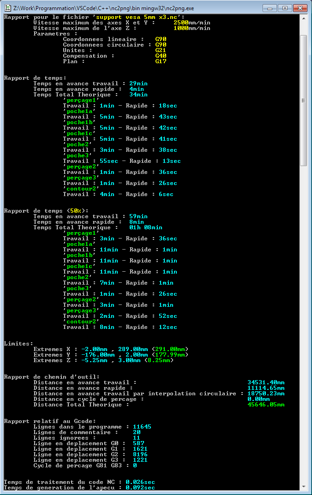
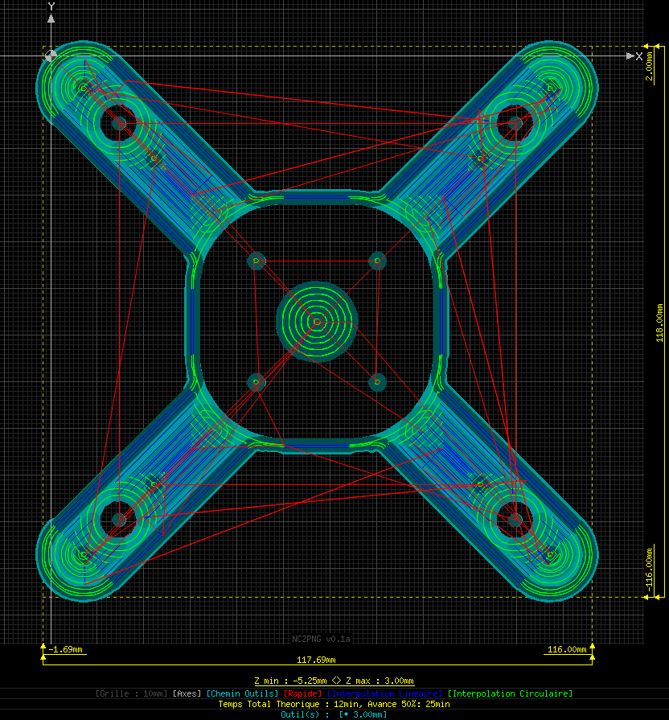
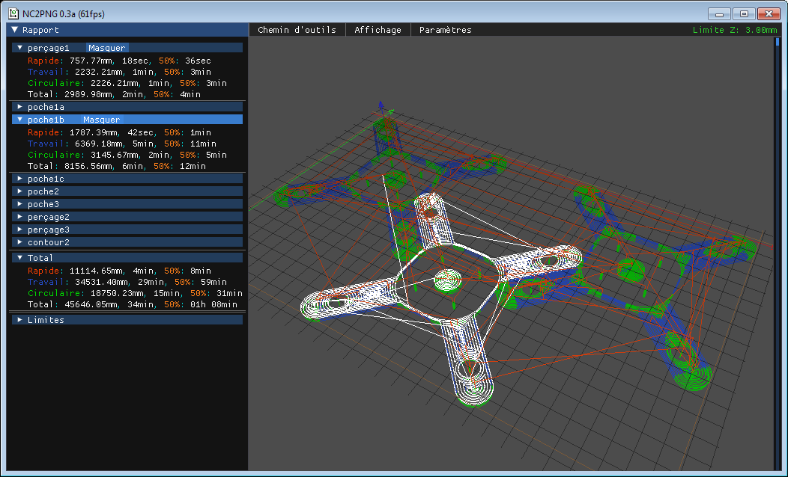
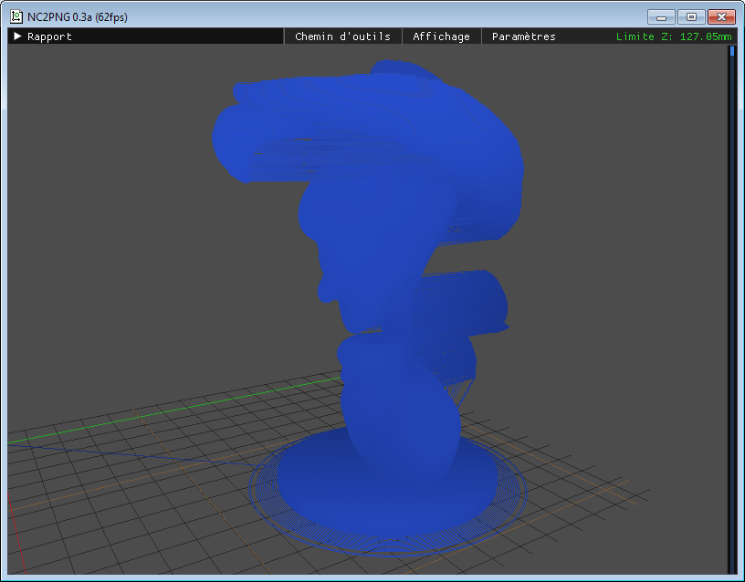
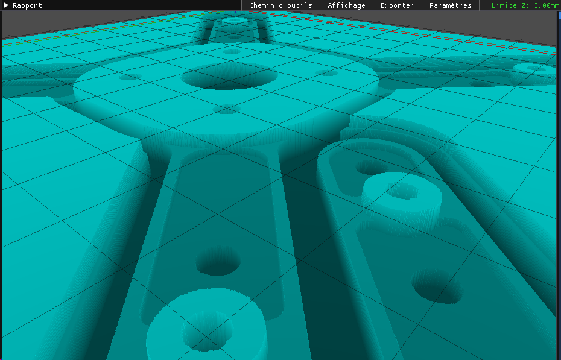
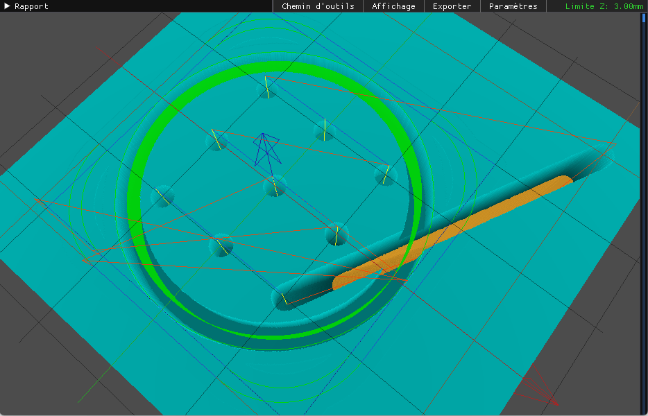
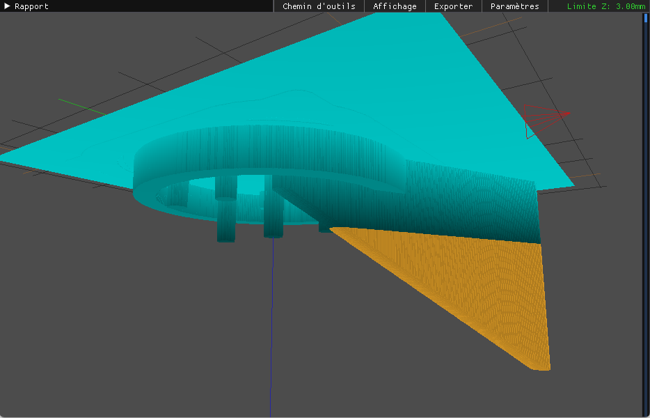

# nc2png  
Generate preview and time estimations based on gcode file (milling/fdm), English and French localized.  
This program provided "as is", use at your own caution.  
  
Based on a PHP script I made years ago to help me figure out time required to mill parts as well as toolpaths preview.  
  
Uses [libGD](https://libgd.github.io/), [libpng](http://www.libpng.org/), [zlib](https://zlib.net/) for the console part.  
Uses [GLFW](https://www.glfw.org/), [GLAD](https://glad.dav1d.de/), [GLM](https://github.com/g-truc/glm), [ImGui](https://github.com/ocornut/imgui) for the OpenGL part.  
A massive thanks to Joey de Vries for its amazing [Learn OpenGL](https://learnopengl.com) website, it did help a ton to make the OpenGL part.  
  
Require [Ansicon](https://github.com/adoxa/ansicon) to be installed for Windows version NOT running Windows Console by default (check ``Windows Console`` section for more informations).  
Require zlib1g-dev, libpng-dev, libgd-dev, libgl-dev, libglfw3-dev to be installed on Linux in order to compile.  
  
  
#### Limitations (may be implemented in the future):  
- This code will still be messy.  
- Doesn't support axis accelerations or jerks.  
  
  
#### Limitations (very low chance of implementation):  
- Units : G20 (inch coordonates system) ignored, will be considered as mm.  
- Work plane : Only support G17 (XY plane), G18-19 are ignored.  
- Tool compensation : Only support no compensation (G40), G41-42 codes are ignored.  
  
  
#### Windows Console specific (Windows 10/11 H2 or newer):  
- With "recent" Windows updates (late 2021+), console programs running with cmd.exe (conhost.exe) are now using Windows Console by default.  
- Since Windows Console doesn't handle process/thread creation the "old way" and also alreadysupports ANSI formatting, you should compile the program without ANSICON support by defining 'WINCON' in compiling command line (e.g. adding -DWINCON to compile line).  
- Precompiled version will provid both ANSICON compatible executable (nc2png.exe) and also "ANSI no check" version of the program (nc2png-wincon.exe).  
- Config file (nc2png.cfg) is shared between ANSICON and WINCON version, no need to split folders when in multi compatible systems (mainly network shared folders).  
  
  
#### Features (updated version) :  
- Work in absolute and relative mode (G90-91-90.1-91.1), note: Relative mode not fully tested.  
- Support linear as well as circular moves (G0-1-2-3).  
- Support of drilling cycles (currently G81-82-83-80).  
- Output a "full" report containing detailled times and travel distances.  
- Multi-language support based on system language (currently only support EN/FR).  
- Can be compiled on Windows and Linux (may depend on distro).  
- Proper UTF8 to CP850 comments conversion for Windows command.  
- OpenGL viewport (note: Antialiasing disabled by default as it drops framerate over 10 times compared to normal mode without real benefits)
  
  
#### Update 0.4 specific notes:
- Massive modifications on internal work/code.
- Multi languages support eased.
- Config file parser reworked using implement fixes from other projects (vars name, data type, comments) plus other upgrades.
- Gcode parser performance/compat upgrade (10-20% faster):
  * Use of custom a strtok() function to increase parser performance on 100k+ lines gcode files (mainly aiming FDP printer gcode).
  * Better detection of CutView data.
  * Comment parsing rework.
- LibGD upgrade (png file output):
  * Performance update.
  * Depth map export if CutView tools data detected.
- Implement output of HTML with embed SVG/JS data:
  * This may be droped in the future, the amount a lines and circles make browser lag badly (even on modern systems).
  * Allow interactive navigation thru the data extracted from gcode file.
  * Since SVG isn't a rasted format file, output file will be bigger than original file (sometime massively bigger).
  * Preview performance will depend on user computer and browser used.
  * Still in primitive state.
- Better debug outputs (including gcode, png, svg, gl).
  
  
#### Preview features :  
- Partially compatible with Cutview codes (used to include visual tool cut width).  
- Different colors depending on the kind of move.  
- If containing Cutview tool definition, display "cut" toolpaths with variable color depending on cut depth.  
- PPM implementation to allow real size printing.
  
  
  
  
  
#### OpenGL preview features :  
  - 3D viewport.
  - Darken toolpaths based on camera/grid position to increase readability on FDM based Gcode files.
  - Partial times report.
  - Slider to limit toolpath visualization
  - Allow to display/hide subgrid/grid/axis/gcode "layers" and separate toolpaths kind.
  - Allow to edit configuration file via Gui.
  - Depthmap to "preview" material removal.
  - color highlighted possible tool crash.
  - external debug shaders can be used, look at ./include/glsl_shaders folder for more informations.
  
  
  Note:  
  Preview can fail and program closes without notice on Windows 10/11.  
  This can be caused (on multi GPUs/monitors systems) by the way Windows power management works, A possible fix is to force usage of a specific GPU (Computer settings > System > Display > Graphics settings).  
  
Toolpaths reports:  
  
  
FDM,FFM visual preview:  
  
  
OpenGL tool cut depth preview:  
  
  
OpenGL tool crash preview (STILL A PRIMITIVE DETECTION, this mainly triggers if G0 goes under working depth):  
 
 
  
#### OpenGL preview specific notes :
- The program allow loading of external OpenGL shaders, this is mainly used for debug purpose. You can copy content of ./include/glsl_shaders folder to program folder to debug bogus GLSL shaders. it is highly recommanded to edit "nc2png.cfg" and set "debugOpenGL" to 1 to know if external shader compiled successfully.
  
  
#### Usage :  
Extract files wherever you want than drag a .nc/.gcode or any file that contain Gcode.  
Run program without arguments to get usage list.  
You can also set the program as default open.  
  
  
### Compile :  
Note before start:  
If you want to try this program and don't trust my release, well, you will have hard time...  
I will only provide a 32bits version because many hobbyist run CNC software that require use of the parallel port to control theres machine (not allowed on W64 without use of a specific driver).  
To avoid as much hypocrisy as possible, all binaries I compile on Linux have debug symbols removed (can easily save 25-50% size).  
Something to keep in mind here is that compiling on Windows allow easier debugging but shouldn't be done if you plan to have some portability.  
Depending on the way you compile this program, overhead will be high (Windows, excl program, tested in a virgin W10 VM):  
- VScode, MSYS2 (32bits) on Windows: 27 dlls from MSYS64 mingw32 'bin' dir with a total size of 11.3Mb.  
- VScode, MSYS2 (64bits) on Windows: 27 dlls from MSYS64 mingw64 'bin' dir with a total size of 10.7Mb.  
- Cross compile via Linux, require only 3 dlls for a total of < 1Mb incl program (XP->W10), please note that compiling directly compile on Windows allow for easy debugging.  
  
#### Using MSYS2 and VScode:  
Required DLLs (32bits or 64bits) : glfw3.dll, imagequant.dll, libbrotlicommon.dll, libbrotlidec.dll, libbz2-1.dll, libdeflate.dll, libexpat-1.dll, libfontconfig-1.dll, libfreetype-6.dll, libgcc_s_dw2-1.dll, libgd.dll, libglib-2.0-0.dll, libgraphite2.dll, libharfbuzz-0.dll, libiconv-2.dll, libintl-8.dll, libjbig-0.dll, libjpeg-8.dll, liblzma-5.dll, libpcre-1.dll, libpng16-16.dll, libstdc++-6.dll, libtiff-5.dll, libwebp-7.dll, libwinpthread-1.dll, libXpm-noX4.dll, libzstd.dll, zlib1.dll  
  
Important notes:
In following lines, you will have to replace {MSYS2_PATH} by your full path to MSYS2 e.g C:\msys64 for default path.  

- Download lastest package from [MSYS2](https://www.msys2.org/)
  
- Run MSYS2 MinGW and install needed packages :
  - 32bits : `pacman -S --needed base-devel mingw-w64-i686-toolchain mingw-w64-i686-libgd mingw-w64-i686-glfw`
  - 64bits : `pacman -S --needed base-devel mingw-w64-x86_64-toolchain mingw-w64-x86_64-libgd mingw-w64-x86_64-glfw`
  
- Update Windows environnement variable 'Path' by adding proper path :
  - 32bits : `{MSYS2_PATH}\mingw32\bin`
  - 64bits : `{MSYS2_PATH}\mingw64\bin`  
  
- From sources downloaded from Github:
  - Update `.vscode\tasks.json` to correct MSYS2 paths.
  
- Compile the program in VScode.
  
#### Cross-compile on Linux (Ubuntu Server):  
Everything done here using terminal.  
Require `make`, `git`, `tar`, `mingw-w64`, `mingw-w64-tools`, `unzip`, `dos2unix` packages to be installed.  
  
Since I do update this project when now need applies, some libraries urls may change over time, if you get 404 errors, please check following website for updated versions:  
- https://zlib.net/
- https://sourceforge.net/projects/libpng/
- https://github.com/libgd/libgd/
  
Specific note: links are provided "as is". I you do have troubles sourcing files, please open a issue.  

```
cd $HOME
mkdir work
cd work
mkdir libs
mkdir build
cd libs
wget https://zlib.net/zlib1212.zip
unzip zlib1212.zip
wget https://sourceforge.net/projects/libpng/files/libpng16/1.6.37/lpng1637.zip
unzip lpng1637.zip
wget https://github.com/libgd/libgd/releases/download/gd-2.3.2/libgd-2.3.2.tar.gz
tar -xf libgd-2.3.2.tar.gz
```

Now lets prepare compilation scripts, in order to work this will have to be done in a specific order : `zlib`, `libpng` then `libgd`.  
All these scripts will have to be created in `$HOME/work/libs`, don't miss to chmod +x each scripts once saved.  
  
Create 'zlib.sh':  
```
#!/bin/bash
rm ../build/zlib1.dll
cd zlib-1.2.12
PREFIXDIR=$HOME/work/libs/zlib-1.2.12
make -f win32/Makefile.gcc clean
make -f win32/Makefile.gcc BINARY_PATH=$PREFIXDIR/bin INCLUDE_PATH=$PREFIXDIR/include LIBRARY_PATH=$PREFIXDIR/lib SHARED_MODE=1 STATIC_MODE=1 PREFIX=i686-w64-mingw32- install
cd ..
cp zlib-1.2.12/zlib1.dll ../build/zlib1.dll
```
  
Create 'libpng.sh':  
```
#!/bin/bash
rm ../build/libpng16-16.dll
cd lpng1637
export CC='i686-w64-mingw32-gcc -static-libgcc'
export ZLIBLIB=$HOME/work/libs/zlib-1.2.12/lib
export ZLIBINC=$HOME/work/libs/zlib-1.2.12/include
export CFLAGS="-g -static-libgcc"
export CPPFLAGS="-I$ZLIBINC"
export LDFLAGS="-L$ZLIBLIB"
export LD_LIBRARY_PATH="$ZLIBLIB:$LD_LIBRARY_PATH"
dos2unix -f config.guess config.sub configure configure.ac missing scripts/*.* *.c *.h
make clean
./configure --host=i686-w64-mingw32 --enable-static=libgcc --enable-shared --enable-static --prefix=$PWD/tmp
dos2unix -f libtool Makefile depcomp
make
make install
dos2unix -f tmp/include/libpng16/*.h
cd ..
cp lpng1637/.libs/libpng16-16.dll ../build/libpng16-16.dll
i686-w64-mingw32-strip ../build/libpng16-16.dll
```
  
Create 'libgd.sh':  
```
#!/bin/sh --
rm ../build/libgd-3.dll
cd libgd-2.3.2
export CC=i686-w64-mingw32-gcc
export CFLAGS=" -g "
export LIBZ_CFLAGS=" -g "
export LIBZ_LIBS=" -lz "
export LIBPNG_CFLAGS=" -g "
export LIBPNG_LIBS=" -lpng "
./configure --host=i686-w64-mingw32 --enable-shared --disable-static --prefix=$PWD/tmp --with-zlib=$HOME/work/libs/zlib-1.2.12 --with-png=$HOME/work/libs/lpng1637/tmp
make clean
make
make install
cd ..
cp libgd-2.3.2/src/.libs/libgd-3.dll ../build/libgd-3.dll
i686-w64-mingw32-strip ../build/libgd-3.dll
```
  
Lets compile libraries, get the program :  
```
dos2unix -f zlib.sh libpng.sh libgd.sh
chmod +x zlib.sh libpng.sh libgd.sh
./zlib.sh
./libpng.sh
./libgd.sh
cd $HOME/work
git clone https://github.com/porcinus/nc2png
cd nc2png
```
  
Create 'compile.sh':  
```
#!/bin/sh
export libpng_path="$HOME/work/libs/lpng1637/tmp"
export zlib_path="$HOME/work/libs/zlib-1.2.12"
export libgd_path="$HOME/work/libs/libgd-2.3.2/tmp"
export nc2png_src_path="$HOME/work/nc2png/src"
export nc2png_build_path="$HOME/work/build"
rm $nc2png_build_path/nc2png
rm $nc2png_build_path/nc2png.exe
rm $nc2png_src_path/nc2png.res32.o
/usr/bin/i686-w64-mingw32-windres -F pe-i386 -i $nc2png_src_path/nc2png.rc -o $nc2png_src_path/nc2png.res32.o
i686-w64-mingw32-g++ -static-libgcc -static-libstdc++ -s $nc2png_src_path/glad.c $nc2png_src_path/include/imgui/*.cpp $nc2png_src_path/include/imgui/backends/imgui_impl_opengl3.cpp $nc2png_src_path/include/imgui/backends/imgui_impl_glfw.cpp $nc2png_src_path/glcore.cpp $nc2png_src_path/lang.cpp $nc2png_src_path/win.cpp $nc2png_src_path/ansicon.cpp $nc2png_src_path/config.cpp $nc2png_src_path/gdcore.cpp $nc2png_src_path/ncparser.cpp $nc2png_src_path/nc2png.cpp $nc2png_src_path/nc2png.res32.o -o $nc2png_build_path/nc2png.exe -L"$libpng_path/lib" -I"$libpng_path/include" -L"$zlib_path/lib" -I"$zlib_path/include" -L"$libgd_path/lib" -I"$libgd_path/include" -I"$libgd_path/include" -I"$nc2png_src_path/include" -I"$nc2png_src_path/include/imgui" -L"$nc2png_src_path/lib" -lglfw3dll -lgd -lpsapi -lm -lz -std=c++17
i686-w64-mingw32-g++ -DWINCON -static-libgcc -static-libstdc++ -s $nc2png_src_path/glad.c $nc2png_src_path/include/imgui/*.cpp $nc2png_src_path/include/imgui/backends/imgui_impl_opengl3.cpp $nc2png_src_path/include/imgui/backends/imgui_impl_glfw.cpp $nc2png_src_path/glcore.cpp $nc2png_src_path/lang.cpp $nc2png_src_path/win.cpp $nc2png_src_path/ansicon.cpp $nc2png_src_path/config.cpp $nc2png_src_path/gdcore.cpp $nc2png_src_path/ncparser.cpp $nc2png_src_path/nc2png.cpp $nc2png_src_path/nc2png.res32.o -o $nc2png_build_path/nc2png-wincon.exe -L"$libpng_path/lib" -I"$libpng_path/include" -L"$zlib_path/lib" -I"$zlib_path/include" -L"$libgd_path/lib" -I"$libgd_path/include" -I"$libgd_path/include" -I"$nc2png_src_path/include" -I"$nc2png_src_path/include/imgui" -L"$nc2png_src_path/lib" -lglfw3dll -lgd -lpsapi -lm -lz -std=c++17
i686-w64-mingw32-strip $nc2png_build_path/nc2png.exe
i686-w64-mingw32-strip $nc2png_build_path/nc2png-wincon.exe
chmod 755 $nc2png_build_path/nc2png.exe
chmod 755 $nc2png_build_path/nc2png-wincon.exe
```  
  
Lets compile the program :  
```
dos2unix -f compile.sh
chmod +x compile.sh
./compile.sh
```
  
All files you need should be found into `%HOME/work/build/` directory.  
  
#### Compile for Linux (Ubuntu Server):  
Assuming that you already have g++ packages installed, following packages will be required as well : `zlib1g-dev`, `libpng-dev`, `libgd-dev`.  
Clone the git wherever you want then cd into src directory.  
```
#!/bin/sh
export nc2png_src_path="$HOME/work/nc2png/src"
export nc2png_build_path="$HOME/work/build"
rm $nc2png_build_path/nc2png
g++ -w -s $nc2png_src_path/glad.c $nc2png_src_path/include/imgui/*.cpp $nc2png_src_path/include/imgui/backends/imgui_impl_opengl3.cpp $nc2png_src_path/include/imgui/backends/imgui_impl_glfw.cpp $nc2png_src_path/glcore.cpp $nc2png_src_path/lang.cpp $nc2png_src_path/ansicon.cpp $nc2png_src_path/config.cpp $nc2png_src_path/gdcore.cpp $nc2png_src_path/ncparser.cpp $nc2png_src_path/nc2png.cpp -o $nc2png_build_path/nc2png -I"$nc2png_src_path/include" -I"$nc2png_src_path/include/imgui" -lglfw -ldl -lm -lgd -lz -std=c++17
chmod 755 $nc2png_build_path/nc2png
```  
  
## Known issues:
- OpenGL preview not opening on Win10/11 : Please refer to ```OpenGL preview features`` section.
- Program closes on Win10/11 H2 (2022+) : if preview line requirement meet: please check ``Windows Console`` section.
- Some "cut" tool paths preview can look weird, offsized or undersized, this is mainly liked to integer rounding. This problem may be solved in the future when other side projects done.
- On Windows older systems (2000, XP): ```libwinpthread-1 (libwinpthread-1.dll)``` missing, please copy [libwinpthread-1.dll](libwinpthread-1.dll) to your ```nc2png``` folder.
  
## Any other issues:
- Please keep in mind I started this project a very long time ago (10+yrs).  
- I do work on this project on my spare time when I feel the need to implement fixes and new things.  
- I am open to suggestions.  
- Please open a Issue if you think behave a abnormal way.  
- PLEASE keep in mind that this tool is AND WILL REMAIN a 2.5D tool.  

